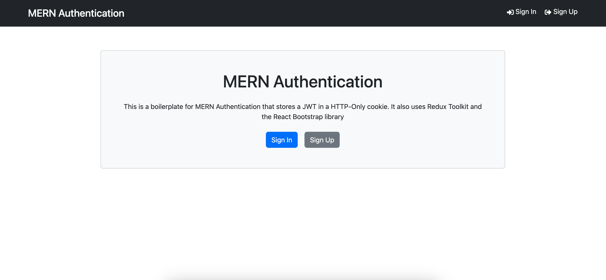

# Mern Authentication

This is for SPA (Single Page Authentication) workflow that uses the [Vite](https://vite.dev) Build tools.



It includes the following:
- Backend API with Express & MongoDB
- Route for auth, logout, register, profile, update profile
- JWT authentication stored in HTTP-only cookie
- Protected routes and endpoints
- Custom middleware to check JSON web token and store in cookie
- Custom error middleware
- React frontend to register, login, logout, view profile and update profile
- React Bootstrap UI library
- React toastify notifications

## Usage
- Create a MongoDB database and obtain your `MongoDB URI`

### Environment variables
Create `.env` file in the root directory and add the following
```
NODE_ENV=development
PORT=5000
MONGO_URI=MongoDB_URI
JWT_SECRET=abc123
```

### Install dependencies (frontend and backend)
```
npm install
cd frontend
npm install
```

### Run
```
# Run frontend (:3000) & backend (:5000)
npm run dev

# Run backend only
npm run server
```

## Build & Deploy
```
# Create frontend production build
cd frontend
npm run build
```